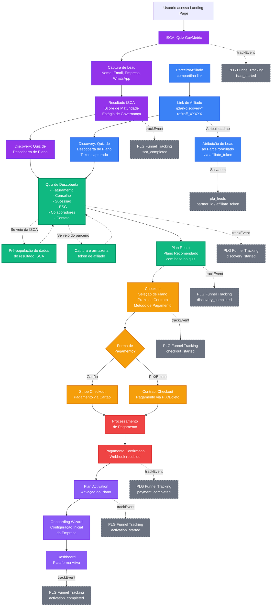

# Fluxo PLG Legacy OS - Diagrama Completo

Este documento apresenta o fluxo completo de Product-Led Growth (PLG) da plataforma Legacy OS, incluindo as duas formas de acesso ao Discovery: via ISCA (isca) ou através de link direto de Parceiro/Afiliado.

## Diagrama Mermaid

## Descrição do Fluxo

### Entrada 1: Fluxo da ISCA (Isca)

1. **ISCA (GovMetrix Quiz)**: O usuário acessa a landing page e inicia o quiz de diagnóstico de maturidade em governança corporativa.
2. **Captura de Lead**: Durante o quiz, são coletados dados do lead (nome, email, empresa, WhatsApp).
3. **Resultado ISCA**: Após completar o quiz, o usuário recebe seu score de maturidade e estágio de governança.
4. **Discovery**: O usuário é direcionado para o Quiz de Descoberta de Plano, onde os dados da ISCA são pré-populados.

### Entrada 2: Link do Parceiro/Afiliado

1. **Parceiro/Afiliado**: Um parceiro ou afiliado compartilha seu link único de afiliado.
2. **Link de Afiliado**: O link tem o formato `/plan-discovery?ref=aff_XXXXX`, onde `aff_XXXXX` é o token único do parceiro.
3. **Discovery**: O usuário acessa diretamente o Quiz de Descoberta de Plano, e o token de afiliado é capturado e armazenado para atribuição posterior.

### Convergência no Discovery

Ambos os fluxos convergem no **Quiz de Descoberta de Plano**, que coleta:
- Faturamento da empresa
- Existência de conselho
- Planejamento de sucessão
- Avaliação ESG
- Número de colaboradores
- Dados de contato

**Características especiais:**
- Se veio da ISCA: os dados são pré-populados com base no resultado do diagnóstico.
- Se veio do parceiro: o token de afiliado é capturado e armazenado para atribuição do lead.

### Fluxo Após Discovery

1. **Plan Result**: Apresenta o plano recomendado com base nas respostas do quiz.
2. **Checkout**: Usuário seleciona o plano, prazo de contrato e método de pagamento.
3. **Processamento de Pagamento**: 
   - **Cartão**: Via Stripe Checkout
   - **PIX/Boleto**: Via Contract Checkout (Asaas)
4. **Pagamento Confirmado**: Webhook confirma o pagamento.
5. **Plan Activation**: O plano é ativado.
6. **Onboarding**: Wizard de configuração inicial da empresa.
7. **Dashboard**: Usuário acessa a plataforma ativa.

### Rastreamento PLG

Todo o fluxo é rastreado através do sistema PLG Funnel Tracking, registrando eventos em cada etapa:
- `isca_started` / `isca_completed`
- `discovery_started` / `discovery_completed`
- `checkout_started` / `checkout_completed`
- `payment_started` / `payment_completed`
- `activation_started` / `activation_completed`

### Atribuição de Leads

Quando o usuário acessa via link de afiliado:
- O token `aff_XXXXX` é capturado e armazenado.
- O lead é atribuído ao parceiro/afiliado correspondente.
- Os dados são salvos na tabela `plg_leads` com `partner_id` ou `affiliate_token`.

## Tecnologias e Integrações

- **ISCA**: Quiz GovMetrix para diagnóstico de maturidade
- **Discovery**: Quiz de descoberta de plano personalizado
- **Stripe**: Processamento de pagamentos via cartão
- **Asaas**: Processamento de pagamentos via PIX/Boleto
- **Supabase**: Banco de dados e rastreamento PLG
- **LocalStorage**: Armazenamento temporário de dados do funil

## Métricas Rastreadas

- Tempo até Discovery (timeToDiscovery)
- Tempo até Checkout (timeToCheckout)
- Tempo até Pagamento (timeToPayment)
- Tempo até Ativação (timeToActivation)
- Tempo total da jornada (totalJourneyTime)
- Taxa de conversão por etapa
- Taxa de abandono (drop-off) por etapa
- Atribuição de leads por parceiro/afiliado
